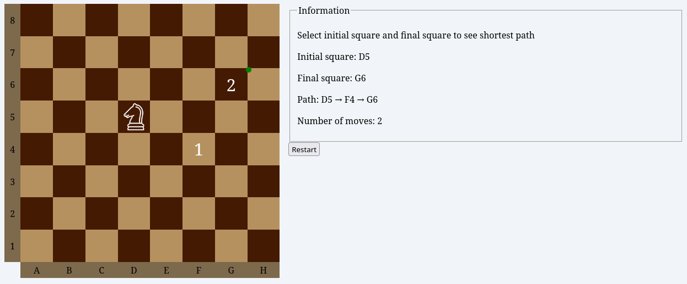

# Knight Travails
Knight Travails game implemented in Javascript.

It shows the shortest possible way a chess knight can make to get from one square to another.

## Links
- [Knight Travails Visualizer](https://angelrcd.github.io/odin-knight-travails/)
- [Link to assignment](https://www.theodinproject.com/lessons/javascript-knights-travails)

## Summary
All of the game related logic can be found in my `knightTravails.js` file. It treats all the possible moves a knight could make from it's current position as childrens of a tree. Then to search for the goal square, it traverses the tree in level order.
